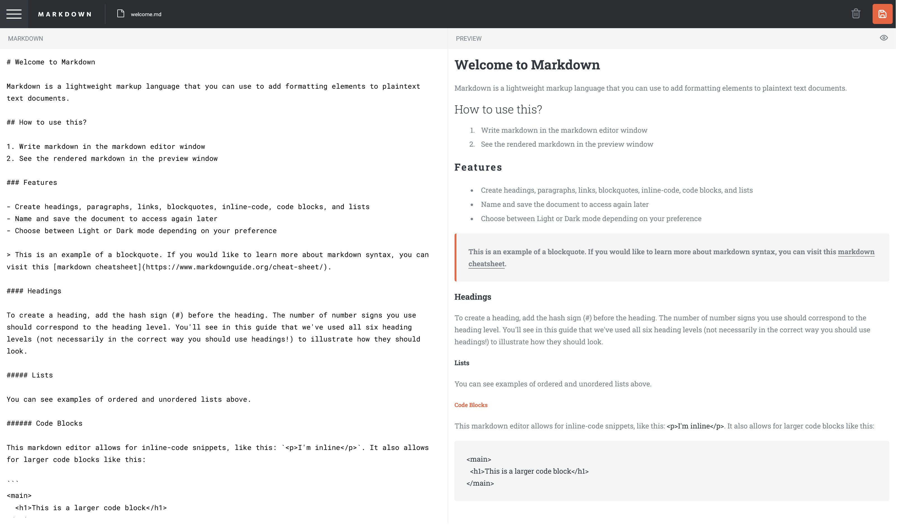

# Frontend Mentor - In-browser Markdown Editor Solution

This is my solution to the [In-browser Markdown Editor challenge on Frontend Mentor](https://www.frontendmentor.io/challenges/inbrowser-markdown-editor-r16TrrQX9). Frontend Mentor challenges are a valuable way to enhance coding skills by building practical projects.

## Table of Contents

- [Overview](#overview)
  - [The Challenge](#the-challenge)
  - [Screenshot](#screenshot)
  - [Links](#links)
- [My Process](#my-process)
  - [Built With](#built-with)
  - [What I Learned](#what-i-learned)
  - [Continued Development](#continued-development)
  - [Useful Resources](#useful-resources)
- [Author](#author)
- [Acknowledgments](#acknowledgments)

## Overview

### The Challenge

Users can:

- Create, Read, Update, and Delete markdown documents.
- Name and save documents for future access.
- Edit markdown content with a live preview.
- View a full-page preview of formatted content.
- Experience responsive design for various screen sizes.
- Interact with hover states for interactive elements.
- Use localStorage for browser-state persistence.
- Perform all functionalities with convenient shortcuts.

### Screenshot



### Links

- Live Site URL: [ledminh-markdown-editor](https://ledminh-markdown-editor.netlify.app/)

## My Process

### Built With

- Semantic HTML5 markup
- CSS custom properties
- Flexbox
- CSS Grid
- Mobile-first workflow
- [UUID](https://www.npmjs.com/package/uuid) - To create unique IDs
- [Marked-React](https://www.npmjs.com/package/marked-react) - For easy Markdown transformation in React
- [React](https://reactjs.org/) - JavaScript library
- [Next.js](https://nextjs.org/) - React framework
- [SASS](https://sass-lang.com/) and CSS Modules - For styling
- [Netlify](https://www.netlify.com) - For hosting

### What I Learned

#### Making Textareas Grow with Content

While building this app, I learned a useful trick for making textareas grow with content:

1. Set the textarea's height to an empty string to prevent height glitches.
2. Set the textarea's height to `scrollHeight + some margin`.
3. Set the parent element's `overflow-y` to hidden.

This approach eliminates scrollbar flickering when content overflows. Here's the code snippet:

```ts
onChange={(e) => {
  if (textAreaRef.current) {
    setContent(textAreaRef.current.value);
    textAreaRef.current.style.height = '';
    textAreaRef.current.style.height = textAreaRef.current.scrollHeight + 8 + 'px';
  }
}}
```

#### Naming New Files

I added a feature inspired by OS file naming conventions. When users create a new unsaved file, its name defaults to 'new-file.md'. If multiple unsaved files exist, they are named 'new-file-1.md', 'new-file-2.md', and so on. Deleting a file adjusts the naming accordingly. Here's the implementation in [useData/counter.tsx](./useData/counter.tsx).

### Continued Development

For future improvements, I plan to make this app a full-stack solution with user registration and document storage in a database.

## Author

- Website - [ledminh.dev](https://www.ledminh.dev)
- Frontend Mentor - [@ledminh](https://www.frontendmentor.io/profile/ledminh)
- Twitter - [@MinhLe](https://twitter.com/MinhLe29056419/)
